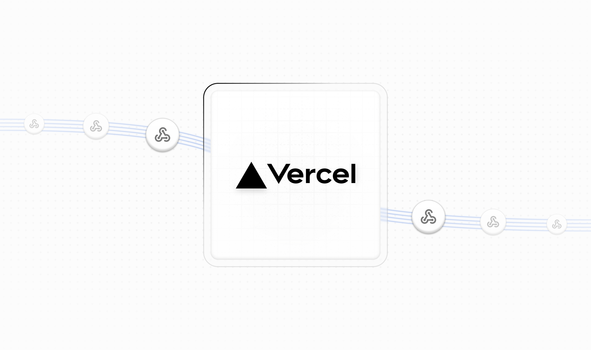
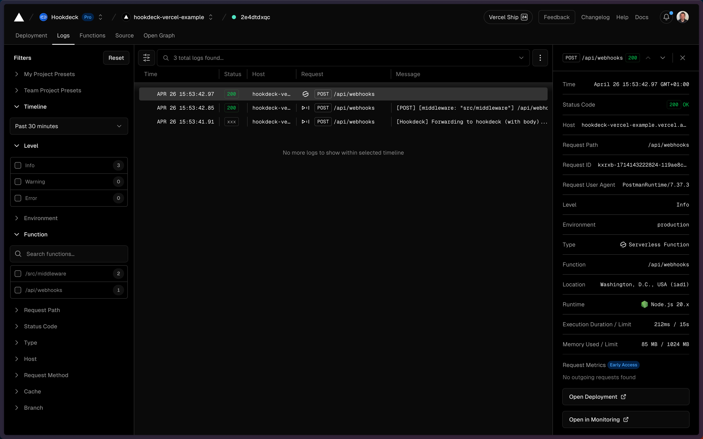
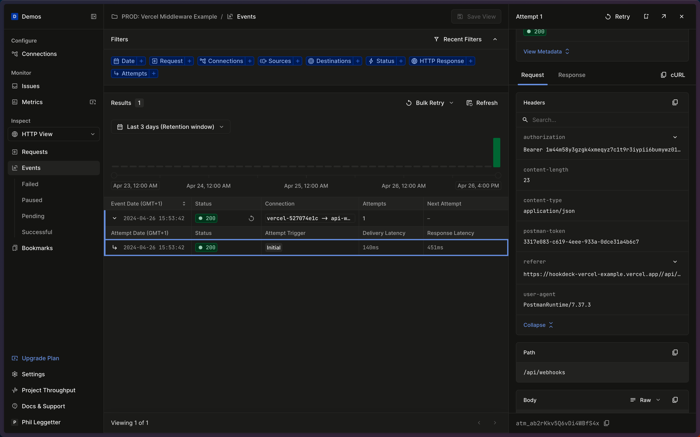
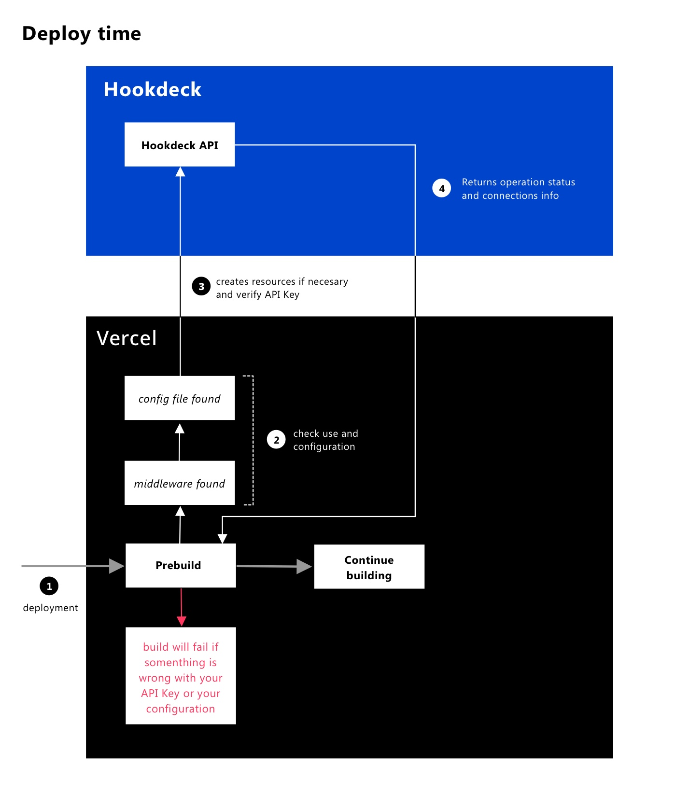
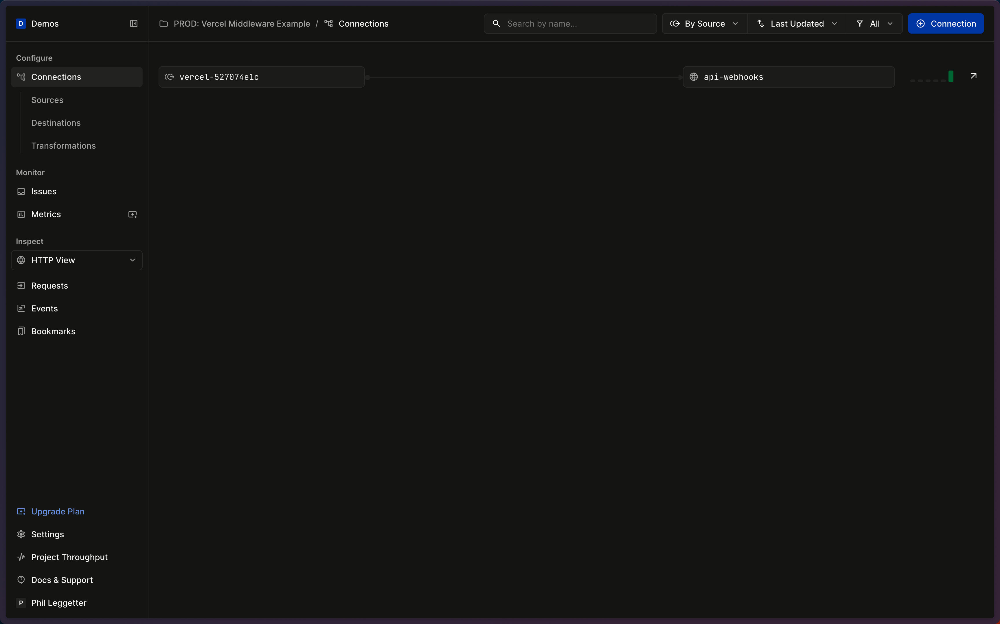
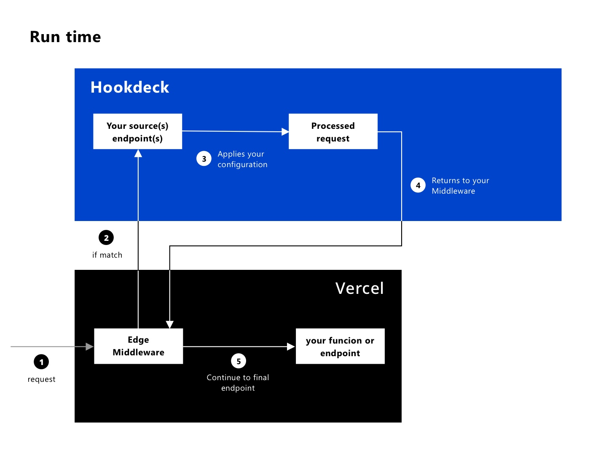

# Hookdeck Vercel Middleware

The Hookdeck Vercel Middleware adds the ability to authenticate, delay, filter, queue, throttle, and retry asynchronous HTTP requests (e.g., webhooks) made to a Vercel application. The use cases for this include managing webhooks from API providers such as Stripe, Shopify, and Twilio, or when building asynchronous APIs.



## Get Started

Before you begin:

- Ensure you have an application with the [Vercel Edge Middleware](https://vercel.com/docs/functions/edge-middleware/quickstart) installed.
- Create a [Vercel](https://vercel.com?ref=github-hookdeck-vercel) account and a project.
- [Signup for a Hookdeck account](https://dashboard.hookdeck.com/signup?ref=github-hookdeck-vercel) and create your Hookdeck project.
- Get the Hookdeck API key and Signing Secret from your [project secrets](https://dashboard.hookdeck.com/settings/project/secrets?ref=github-hookdeck-vercel).
- Add `HOOKDECK_API_KEY` and `HOOKDECK_SIGNING_SECRET` as [environmenet variable](https://vercel.com/docs/projects/environment-variables?ref=github-hookdeck-vercel)
  for your Vercel project.

Install the Hookdeck Vercel package:

```bash
npm i @hookdeck/vercel
```

> Once installed, package a `hookdeck.config.js` file and a `.hookdeck` directory are created at the root of your project. Also, the command `node .hookdeck/prebuild.js` is appended to the `prebuild` script of your `package.json`.

Ensure the `match` in `hookdeck.config.js` matches the route you want the middleware to intercept:

```js
/** @type {import("@hookdeck/vercel").HookdeckConfig} */
const hookdeckConfig = {
  match: {
    '/api/webhooks': {},
  },
};

module.exports = hookdeckConfig;
```

Update `middleware.ts` (or `middleware.js`) to add the Hookdeck Vercel Middleware and ensure `config.matcher` has the same value as you have in `hookdeck.config.js` (e.g., `/api/webhooks`):

```typescript
import { withHookdeck } from '@hookdeck/vercel';
import hookdeckConfig from './hookdeck.config';

import { NextResponse } from 'next/server';

export const config = {
  matcher: '/api/webhooks',
};

function middleware(request: Request) {
  // ... existing or additional your middleware logic

  NextResponse.next();
}

// wrap the middleware with Hookdeck wrapper
export default withHookdeck(hookdeckConfig, middleware);
```

If you don't already have a route, create one. For example, `app/api/webhooks/route.ts` for the `/api/webhooks` endpoint in a Next.js app using the app router:

```typescript
export async function POST() {
  const data = { received: true };

  return Response.json(data);
}
```

Deploy the application to Vercel.

Once the deployment has succeeded, request your middleware endpoint:

```bash
curl --location 'http://your.vercel.app/api/webhooks' \
--header 'Content-Type: application/json' \
--data '{
    "test": "value"
}'
```

Check the Vercel logs to check the middleware is processing the events:



Check the Hookdeck logs to check the request are handled and the events are being processed and delivered:



## Configuration

## Environment Variables

Environment variables used by the middleware. Get the values from the [Hookdeck project secrets](https://dashboard.hookdeck.com/settings/project/secrets?ref=github-hookdeck-vercel).

- `HOOKDECK_API_KEY`: The Hookdeck project API Key used to manage the [connections](https://hookdeck.com/docs/connections?ref=github-hookdeck-vercel) within your project.
- `HOOKDECK_SIGNING_SECRET`: Used to check the signature of the inbound HTTP request when it is received from Hookdeck. See [webhook signature verification](https://hookdeck.com/docs/authentication#hookdeck-webhook-signature-verification?ref=github-hookdeck-vercel). Get the value from the [Hookdeck project secrets](https://dashboard.hookdeck.com/settings/project/secrets?ref=github-hookdeck-vercel).

You can also set these values programmatically within `hookdeck.config.js`.

### `middleware.ts`

The [Vercel Edge Middleware](https://vercel.com/docs/functions/edge-middleware?ref=github-hookdeck-vercel) must be updated as follows:

1. Update the exported `config.matcher` to match the route for the Hookdeck Vercel Middleware
2. Import and use `withHookdeck` middleware wrapper

```typescript
// add Hookdeck imports
import { withHookdeck } from '@hookdeck/vercel';
import hookdeckConfig from './hookdeck.config';

export const config = {
  matcher: 'path/to/match',
};

// the middleware is not exported anymore
function middleware(request: Request) {
  // ... your middleware logic
  // return `NextResponse.next()` or `next()` to manage the request with Hookdeck
}

// wrap the middleware with Hookdeck wrapper
export default withHookdeck(hookdeckConfig, middleware);
```

### `hookdeck.config.js`

The minimum configuration is the following, with the `match` containing an object with a matching path (`path/to/match`) as the key. This value should be the same as the value exported via `config.matcher` in `middleware.ts`.

```js
/** @type {import("@hookdeck/vercel").HookdeckConfig} */
const hookdeckConfig = {
  match: {
    'path/to/match': {},
  },
};

module.exports = hookdeckConfig;
```

> IMPORTANT: Ensure `config.matcher` in your `middleware` includes the routes specified in the `hookdeck.config.js` `match` fields. Only routes that match both expressions will trigger the Hookdeck functionality.

Full configuration options:

- `api_key`: The Hookdeck project API Key used to manage the [connections](https://hookdeck.com/docs/connections?ref=github-hookdeck-vercel) within your project. This config value will override the `HOOKDECK_API_KEY` environment variable. Get the value from the [Hookdeck project secrets](https://dashboard.hookdeck.com/settings/project/secrets?ref=github-hookdeck-vercel).
- `signing_secret`: Used to check the signature of the inbound HTTP request when it is recieved from Hookdeck. This config value will override the `HOOKDECK_SIGNING_SECRET` environment variable. See [webhook signature verification](https://hookdeck.com/docs/authentication#hookdeck-webhook-signature-verification?ref=github-hookdeck-vercel). Get the value from the [Hookdeck project secrets](https://dashboard.hookdeck.com/settings/project/secrets?ref=github-hookdeck-vercel).
- `vercel_url`: The Vercel's url that can receive the requests. If not specified, the host stored in env var `VERCEL_BRANCH_URL` will be used.
- `match`: a key-value map of paths for routes and the configuration for each of those routes.
  - `[path]` - the matching string or regex that will be compared or tested against the pathname of the url that triggered the middleware. If there is more than one match, then the request is sent to every matching configuration.
    - `retry`: use the values specified in the [Retry documentation](https://hookdeck.com/docs/api#retry?ref=github-hookdeck-vercel) to configura Hookdeck's retry strategy.
    - `delay`: the number of milliseconds to hold the event when it arrives to Hookdeck.
    - `filters`: specify different filters to exclude some events from forwarding. Use the syntax specified in the [Filter documentation](https://hookdeck.com/docs/api#filter?ref=github-hookdeck-vercel).
    - `rate`: set the delivery rate to be used for the outcoming traffic. Check the syntax in the `rate_limit_period` key in the [Destination documentation](https://hookdeck.com/docs/api#destination-object?ref=github-hookdeck-vercel).
    - `verification`: inbound (source) verification mechanism to use. Check all possible values and syntax in the [Source documentation](https://hookdeck.com/docs/api#source-object?ref=github-hookdeck-vercel).
    - `custom_response`: the custom response to send back the webhook origin. Check the syntax in the [Source documentation](https://hookdeck.com/docs/api#source-object?ref=github-hookdeck-vercel).

Here's an example with all the configuration options:

```javascript
const {
  RetryStrategy,
  DestinationRateLimitPeriod,
  SourceCustomResponseContentType,
} = require('@hookdeck/sdk/api');

/** @type {import("@hookdeck/vercel").HookdeckConfig} */
const hookdeckConfig = {
  // vercel_url: '', // optional. Uses `VERCEL_BRANCH_URL` env var as default.
  match: {
    '/api/webhooks': {
      // all these fields are optional
      retry: {
        strategy: RetryStrategy.Linear,
        count: 5,
        interval: 1 * 60 * 1000, // in milliseconds
      },
      delay: 1 * 60 * 1000, // in milliseconds
      filters: [
        {
          headers: {
            'x-my-header': 'my-value',
          },
          body: {},
          query: {},
          path: {},
        },
      ],
      rate: {
        limit: 10,
        period: DestinationRateLimitPeriod.Minute,
      },
      verification: {
        type: 'API_KEY',
        configs: {
          header_key: 'x-my-api-key',
          api_key: 'this-is-my-token',
        },
      },
      custom_response: {
        content_type: SourceCustomResponseContentType.Json,
        body: '{"message": "Vercel handled the webhook using Hookdeck"}',
      },
    },
  },
};

module.exports = hookdeckConfig;
```

This includes request delay, retry, and a rate of delivery:

```javascript
const { RetryStrategy, DestinationRateLimitPeriod } = require('@hookdeck/sdk/api');

/** @type {import("@hookdeck/vercel").HookdeckConfig} */
const hookdeckConfig = {
  vercel_url: 'https://my-vercel-project-eta-five-30.vercel.app',
  match: {
    '/api/webhook': {
      name: 'my-webhook-source-name',
      retry: {
        strategy: RetryStrategy.Linear,
        count: 5,
        interval: 15000, // in ms
      },
      delay: 30000, // in ms
      rate: {
        limit: 100,
        period: DestinationRateLimitPeriod.Minute,
      },
    },
  },
};

module.exports = hookdeckConfig;
```

## Considerations and Limitations

### Removing the Middleware and Going Directly to Hookdeck

The Hookdeck Vercel middleware adds an additional hop to every process request, so if milliseconds are a factor in processing requests, you may want to use Hookdeck directly and not use the middleware.

With the Hookdeck Vercel Middleware:

1. Request to Vercel URL
2. Redirect request to Hookdeck
3. Request to Vercel URL (which the middleware passes through)

Without the Hookdeck Vercel Middleware:

1. Request to Hookdeck Source URL
2. Request to Vercel URL

You can remove the middleware by uninstalling and removing any configuration and directly using the [Hookdeck Source](https://hookdeck.com/docs/sources?ref=github-hookdeck-vercel) URL where you previously used the Vercel URL, for example, as your Stripe or Shopify webhook URL.

### Parallel Matching

If you have multiple entries in the config file with the same `match` path, be aware that the middleware will send the request via `fetch` call once per match and will try to do that in parallel. This heavy use is not a common case, but please check [Edge Middleware Limitations](https://vercel.com/docs/functions/edge-middleware/limitations?ref=github-hookdeck-vercel) if you are in this scenario.

## How the Hookdeck Vercel Middleware Works

The `@hookdeck/vercel` package is supported in the [Vercel's Edge Middleware](https://vercel.com/docs/functions/edge-middleware?ref=github-hookdeck-vercel) and executes before a request is processed on your site. This way, the request can be forwarded to Hookdeck and then received again by your specified endpoint, but with all the extra features you may need from Hookdeck, such as queuing, filters, and retry strategies.

This Hookdeck Vercel Middleware package is used in two stages:

### Deploy/Build

During deployment, a `prebuild`` hook checks a configuration file and dynamically creates and configures a [connection](https://hookdeck.com/docs/connections?ref=github-hookdeck-vercel) in Hookdeck:



For example, the following `hookdeck.config.js`:

```typescript
/** @type {import("@hookdeck/vercel").HookdeckConfig} */
const hookdeckConfig = {
  vercel_url: 'https://hookdeck-vercel-example.vercel.app/',
  match: {
    '/api/webhooks': {},
  },
};

module.exports = hookdeckConfig;
```

Results in something like the following connection being created in Hookdeck:



### Runtime

The package also in runtime by sending to Hookdeck the requests that match your configuration:



When your Edge Middleware is triggered (because your middleware config matches), the `withHookdeck` wrapper acts as follows:

- If there is no config file or none of the entries inside `hookdeck.config.js` matches the route, then your `middleware` function is invoked as is.
  If there are matches with the entries of `hookdeck.config.js` then the following can happen:

  1.  The received request has not been processed by Hookdeck (yet). In this case, your `middleware` function is invoked to obtain a `response`. If the returned value from your `middleware` is `NextResponse.next()` or `next()`, then the request is bounced back to Hookdeck.

      _NOTE_: If you are not using `next/server` or `@vercel/edge`, return a new `Response` with a header `x-middleware-next` with value `"1"` if you want you want Hookdeck to manage your request.

  2.  The received request comes from Hookdeck and has been processed. Then, the request is sent to the final route or URL you specified. Your `middleware` function code will not be executed this time.
